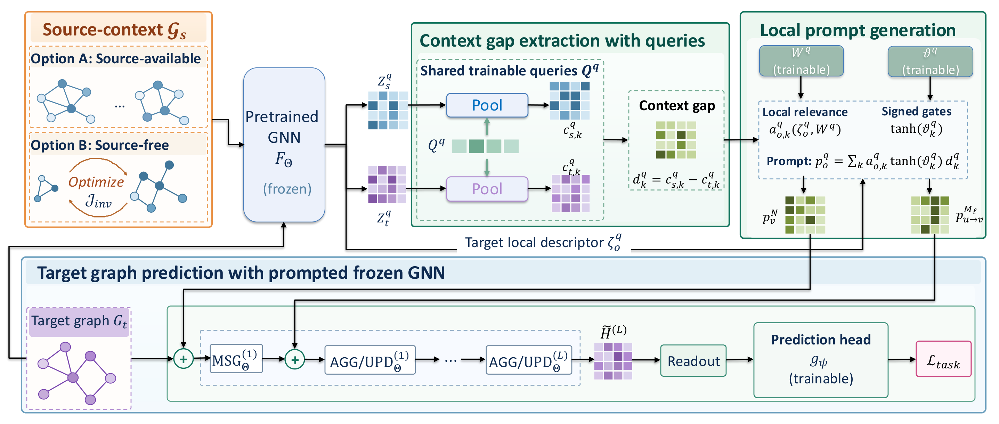

# GapTune: Learning Graph Prompts from Source–Target Context Gaps

[](GapTune-overview.pdf)

GapTune adapts a frozen pretrained GNN to a target task. It learns local prompts whose values are differences between
source and target graph contexts. Shared learnable queries pool the frozen GNN's unprompted initial node states and
layer-wise messages into paired source and target contexts. The context differences (gaps) supply the prompt values.
Local relevance weights and shared signed gates combine them into node and message prompts. A second pass of the frozen
GNN injects these prompts before a task-native readout and head.

- **GapTune+** (source-available) takes source observations from the pretraining graphs.
- **GapTune** (source-free) approximates them with compact proxy graphs obtained by model inversion.

After training, only the pooled source contexts are retained. Inference needs neither source graphs nor proxy graphs.

> **Status.** The pipeline is in place: data preparation, 7 GNN encoders, 6 pretraining objectives, scratch training,
> GapTune/GapTune+ with its ablation variants, and the 12 prompting baselines (including IGAP, MTG and SUPT).

## Repository layout

```
scripts/            CLI entry points (data preparation, pretraining, scratch training, fine-tuning, analyses)
src/config/         yacs defaults for every workflow (override with dotted `key value` pairs on the CLI)
src/data_loader/    dataset registry, few-shot / link splits, SVD feature unification, induced subgraphs
src/model/          GNN encoders: GCN, GAT, GIN, H2GCN, FAGCN, Transformer, NodeFormer
src/pretrain/       AttrMasking, ContextPred, DGI, EdgePred, GraphCL, InfoGraph
src/train/          scratch supervised training (target-supervised controls)
src/finetune/       fine-tuning runner, full fine-tuning / head-only controls, and prompting methods
src/results/        metric policy and LaTeX table builders from outputs/results/*.tsv
src/analysis/       appendix analyses: controlled shifts, context gaps, paired statistics, study runtimes
slurm/              TSV-driven SLURM launchers (pretrain / train / finetune)
tests/              pytest suite
data/, outputs/     datasets and artifacts (git-ignored except dataset lists and .gitkeep files)
```

## Environment set up

```bash
conda create -n gaptune -y python=3.10
conda activate gaptune

pip install torch==2.1.1 --index-url https://download.pytorch.org/whl/cu118
pip install numpy==1.26.1 torch-geometric==2.5.1
pip install torch-scatter==2.1.2 torch-sparse==0.6.18 -f https://data.pyg.org/whl/torch-2.1.1+cu118.html
pip install -r requirements.txt

# CPU-capable test suite
pytest -q
```

The SLURM launchers activate `$CONDA_ENV` (default `agae`, see `slurm/_common.sh`).

## Datasets

| Role | Dataset | Task | Metric |
| --- | --- | --- | --- |
| Target | `photo`, `ogbn-arxiv`, `airports` (USA), `chameleon` | node classification | accuracy |
| Target | `dblp`, `cornell` | link prediction | ROC-AUC |
| Target | `qm7b` (14 targets) | graph regression | MAE |
| Target | `toxcast` (multi-label) | graph classification | ROC-AUC |
| Target | `mnist` | graph classification | accuracy |
| Cross-dataset source | `zinc` (graph level), `pubmed` (node level, induced) | pretraining only | – |

Dataset lists live in `data/available_node_datasets.tsv`, `data/available_graph_datasets.tsv`, and
`data/target_datasets.tsv` (the 9 targets with their task levels). Transfer checkpoints use 100-dimensional inputs
(SVD reduction, or right zero-padding for narrower features).

```bash
# download and preprocess: splits for all 5 seeds, feature SVD, induced subgraphs
python scripts/run_data_preparation.py data_preparation.target_datasets data/target_datasets.tsv
python scripts/run_data_preparation.py data_preparation.target_datasets "zinc,pubmed"
```

The default splits are 5-shot and 100-shot for node and graph tasks. Single-label classification uses k examples per
class; QM7b and ToxCast use k training graphs. Link prediction uses the positive-pair fractions `(0.05,0.10,0.10)` and
`(0.10,0.05,0.10)` for the 5-shot and 100-shot tables.

**Reusing existing data.** `data/datasets`, `data/splits`, `data/feature_svd`, `data/induced_subgraphs`, and
`data/filters` can be symlinks to an existing prepared data tree (for example, AnyGraphAnyExpert's `data/`). The
induced-subgraph cache tag hashes the resolved feature-SVD path, so symlinked data reuses exactly the same splits and
subgraphs. Cache misses are then written into the linked tree. Never regenerate the persisted feature-SVD files:
SVD coordinates are not unique, and pretrained encoders are tied to the stored ones.

## Pretraining

Encoders: `gcn`, `gat`, `gin`, `h2gcn`, `fagcn`, `transformer`, `nodeformer` (`model.name`).
Objectives: `attr_masking`, `context_pred`, `dgi`, `edge_pred`, `graphcl`, `infograph` (`pretrain.method`).

```bash
# same-dataset checkpoint (node/edge targets pretrain on induced node subgraphs)
python scripts/run_pretrain.py \
  model.name gcn \
  pretrain.dataset.name photo pretrain.dataset.task_level node pretrain.dataset.induced True \
  pretrain.method dgi device 0

# cross-dataset transfer checkpoints
python scripts/run_pretrain.py model.name gcn \
  pretrain.dataset.name zinc pretrain.dataset.task_level graph pretrain.dataset.induced False \
  pretrain.method edge_pred device 0
python scripts/run_pretrain.py model.name gin \
  pretrain.dataset.name pubmed pretrain.dataset.task_level node pretrain.dataset.induced True \
  pretrain.method graphcl device 0
```

Checkpoints are written to `outputs/pretrained_models/<dataset>/<run_name>.pt`. Each checkpoint stores the objective's
own head in `extra.pretrain_task_state`, such as the GraphCL projection. Source-free GapTune needs the retained EdgePred
scorer or GraphCL projection. GraphCL checkpoints produced by older code without this field must be re-pretrained.

## Scratch training (target-supervised controls)

```bash
python scripts/run_train.py \
  model.name gcn \
  train.dataset.name photo train.dataset.task_level node train.dataset.induced True \
  train.dataset.task_type classification train.dataset.fixed_split "(5,0.0,1.0)" \
  train.num_runs 5 device 0
```

## Fine-tuning and prompting baselines

| Method | `finetune.method` | Variant flag |
| --- | --- | --- |
| Full fine-tuning | `supervised` | `finetune.supervised.freeze_encoder False` (default) |
| Head-only (frozen encoder) | `supervised` | `finetune.supervised.freeze_encoder True` |
| All-in-One | `all_in_one` | – |
| EdgePrompt / EdgePrompt+ | `edgeprompt` | `finetune.edgeprompt.plus False` / `True` (default) |
| GPF / GPF+ | `gpf` | `finetune.gpf.plus False` (default) / `True` |
| GPPT | `gppt` | – |
| GraphPrompt / GraphPrompt+ | `graphprompt` | `finetune.graphprompt.plus False` (default) / `True` |
| IGAP | `igap` | – |
| MTG | `mtg` | – |
| ProNoG | `pronog` | – |
| SUPT-soft / SUPT-hard | `supt` | `finetune.supt.variant soft` (default) / `hard` |
| GapTune / GapTune+ | `gaptune` | `finetune.gaptune.plus False` / `True` (default) |

The pretrained checkpoint is resolved from the `model.*` and `pretrain.*` keys. To load checkpoints from another
directory, set `pretrain.checkpoint_dir`; to load one file, set `finetune.pretrained_checkpoint`. Each job runs the
5 seeds `[42, 0, 100, 123, 2024]` and appends mean ± sample standard deviation to `outputs/results/finetune.tsv`.

```bash
# cross-dataset: ZINC/GCN/EdgePred -> Photo, 5-shot, GPF+
python scripts/run_finetune.py \
  model.name gcn \
  pretrain.dataset.name zinc pretrain.dataset.task_level graph pretrain.dataset.induced False \
  pretrain.method edge_pred \
  finetune.dataset.name photo finetune.dataset.task_level node finetune.dataset.induced True \
  finetune.method gpf finetune.gpf.plus True \
  --fewshot 5 0.0 1.0 device 0

# same-dataset link prediction: Cornell/GCN/DGI, EdgePrompt, 5-shot partition
python scripts/run_finetune.py \
  model.name gcn \
  pretrain.dataset.name cornell pretrain.dataset.task_level node pretrain.dataset.induced True \
  pretrain.method dgi \
  finetune.dataset.name cornell finetune.dataset.task_level edge finetune.dataset.induced True \
  finetune.method edgeprompt finetune.edgeprompt.plus False \
  finetune.dataset.fixed_split "(0.05,0.1,0.1)" device 0
```

`--fewshot S V T` is shorthand for `finetune.dataset.fixed_split "(S,V,T)"`. With `V = 0`, the split has no validation
set, and checkpoint selection falls back to the training loss. Use `V > 0` for validation-selected checkpoints.

### GapTune

GapTune and IGAP run node and edge targets on induced subgraphs only (`finetune.dataset.induced True`).

- **GapTune+** (`finetune.gaptune.plus True`) samples its fixed source observations from the checkpoint's pretraining
  graphs, rebuilt with the dataset settings stored in the checkpoint.
- **GapTune** (`finetune.gaptune.plus False`) inverts proxy source graphs from an EdgePred or GraphCL checkpoint.
  EdgePred checkpoints with the dot-product scorer need nothing else. GraphCL checkpoints need the retained projection
  in `extra.pretrain_task_state`. `finetune.gaptune.proxy.mode random` gives the random-proxy control.

The ablation switches (`value_mode`, `prompt_locations`, `query_mode`, `mixture`, `gate`) and the proxy settings are
listed under `cfg.finetune.gaptune` in `src/config/_finetune.py`. `prompt_locations none` is the head-only control with
the same readout. In TSVs, the `gaptune_plus` column sets `finetune.gaptune.plus`.

```bash
# cross-dataset: ZINC/GCN/EdgePred -> Photo, 5-shot, source-free GapTune
python scripts/run_finetune.py \
  model.name gcn \
  pretrain.dataset.name zinc pretrain.dataset.task_level graph pretrain.dataset.induced False \
  pretrain.method edge_pred \
  finetune.dataset.name photo finetune.dataset.task_level node finetune.dataset.induced True \
  finetune.method gaptune finetune.gaptune.plus False \
  --fewshot 5 0.0 1.0 device 0
```

## Analyses

`scripts/run_analysis.py analysis.study <name> [key value ...]` runs one appendix study from the `STUDIES` registry in
`src/analysis/run.py`. Shared settings live under `cfg.analysis` in `src/config/_analysis.py`: `repetitions` (ten seeds
by default), `output_dir` (a study writes to `<output_dir>/<study>/<run_tag>/`), checkpoint overrides, and the App. A.4
context-gap sampling budgets `node_budget` and `message_budget`.

## Batch runs on SLURM

Each launcher reads rows from a whitespace-separated TSV (`slurm/<workflow>.tsv` by default, or the file in
`$EXPERIMENT_FILE`). The header comment in each file lists its columns. A node runs 4 GPU tasks, and each task processes
`ROWS_PER_GPU` rows (default 1). Size the array to `ceil(rows / (4 * ROWS_PER_GPU))` elements.

```bash
sbatch --array=0-<N-1> slurm/pretrain.slurm
sbatch --array=0-<N-1> slurm/train.slurm
EXPERIMENT_FILE=slurm/my_grid.tsv ROWS_PER_GPU=2 sbatch --array=0-<N-1> slurm/finetune.slurm

# extra config overrides for every row, e.g. reuse pretrained checkpoints from another tree
EXTRA_ARGS="pretrain.checkpoint_dir <dir>/pretrained_models pretrain.log_dir <dir>/logs/pretrained_models" \
  sbatch --array=0-<N-1> slurm/finetune.slurm
```

The finetune TSV resolves checkpoints through the pretraining metadata logs. When you reuse another tree's
checkpoints, set `pretrain.log_dir` along with `pretrain.checkpoint_dir`.

The same TSVs run locally with `<workflow>.run_tasks_tsv True <workflow>.tasks_tsv <file>`.

## Results tables

```bash
python -m src.results.finetune_tables   # LaTeX tables from outputs/results/finetune.tsv
python -m src.results.train_tables      # scratch controls from outputs/results/train.tsv
```

Besides the per-backbone and per-method grids, `finetune_tables` writes the GapTune paper tables:
`finetune_cross_<shot>_table.tex` (Tables 1/14), `finetune_same_<shot>_table.tex` (Tables 2/15), and
`finetune_ablation_{value,insertion,composition,source}_table.tex` (Tables 3-6). Scratch rows come from
`--train-results-tsv` (default `outputs/results/train.tsv`). An ablation row is identified by the non-default
`finetune.gaptune.*` keys that its run set explicitly, for example `EXTRA_ARGS="finetune.gaptune.value_mode target"`.
The proxy arms also set `gaptune_plus False`. These keys keep ablation rows from overwriting the main GapTune cells.
